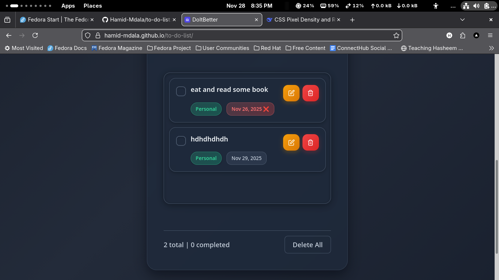

# Task Manager - Modern Todo List Application

A sleek, responsive task management web application built with vanilla JavaScript, featuring a beautiful dark theme and intuitive user interface.





## 🚀 Features

### Core Functionality
- ✅ **Add Tasks** - Create new tasks with descriptions, due dates, and categories
- ✅ **Edit Tasks** - Modify existing tasks with an intuitive modal interface
- ✅ **Delete Tasks** - Remove individual tasks or clear all tasks at once
- ✅ **Mark Complete** - Toggle task completion status with smooth animations
- ✅ **Local Storage** - Automatically saves your tasks in the browser

### Task Organization
- 🏷️ **Categories** - Organize tasks into Personal, Work, School, or Others
- 📅 **Due Dates** - Set and track task deadlines with visual indicators
- ⚠️ **Overdue Alerts** - Automatic highlighting for overdue tasks
- 📊 **Progress Tracking** - Real-time counters for total and completed tasks

### User Experience
- 📱 **Fully Responsive** - Optimized for desktop, tablet, and mobile devices
- 🎨 **Dark Theme** - Eye-friendly interface with beautiful gradients
- ⚡ **Fast & Lightweight** - Built with vanilla JavaScript for optimal performance
- ♿ **Accessible** - Keyboard navigation and screen reader friendly

## 🛠️ Setup Instructions

### Prerequisites
- A modern web browser (Chrome, Firefox, Safari, Edge)
- Basic knowledge of HTML, CSS, and JavaScript (for customization)

### Installation

1. **Clone or Download the Project**
   ```bash
   git clone https://hamid-mdala.github.io/to-do-list/
   ```
   Or download the ZIP file and extract it to your desired location.

2. **Project Structure**
   ```
   TO-DO-LIST/
├── index.html          # Main HTML file
├── style.css           # All styling and responsive design
├── script.js           # Application logic and functionality
├── img/                # Application screenshots
│   ├── image.png        # Desktop view screenshot
│   ├── image-2.png        # Mobile view screenshot  
│   └── image-3.png        # Task management screenshot
└── README.md           # This documentation
   ```

3. **Run the Application**
   - Open `index.html` in your web browser
   - No server required - works directly in the browser
   - For local development, you can use Live Server in VS Code

### Browser Compatibility
- ✅ Chrome 60+
- ✅ Firefox 55+
- ✅ Safari 12+
- ✅ Edge 79+

## 📖 Usage Guide

### Adding a Task
1. Type your task in the "Add a new todo" input field
2. Select a due date using the date picker
3. Choose a category from the dropdown menu
4. Click "Add" or press Enter to create the task

### Managing Tasks
- **Complete Task**: Click the checkbox to mark as complete
- **Edit Task**: Click the pencil (✏️) icon to modify task details
- **Delete Task**: Click the trash (🗑️) icon to remove a task
- **Delete All**: Use the "Delete All" button to clear all tasks

### Task Categories
- **Personal** - Green theme for personal tasks
- **Work** - Blue theme for work-related tasks  
- **School** - Purple theme for educational tasks
- **Others** - Orange theme for miscellaneous tasks

### Due Date Features
- Dates are displayed in a readable format (e.g., "Nov 30, 2025")
- Overdue tasks are highlighted in red with a pulsing animation
- Future dates show in the standard theme color

## 🎨 Customization

### Modifying Colors
Edit the CSS variables in `style.css`:
```css
:root {
    --blue: #60a5fa;        /* Primary blue */
    --green: #34d399;       /* Success green */
    --red: #f87171;         /* Error/danger red */
    --cyan: #22d3ee;        /* Accent cyan */
    --dark: #1e293b;        /* Dark background */
}
```

### Adding New Categories
1. Update the HTML in `index.html`:
   ```html
   <option value="new-category">New Category</option>
   ```

2. Add corresponding CSS in `style.css`:
   ```css
   .category-new-category {
       background: linear-gradient(135deg, rgba(255, 0, 0, 0.2), rgba(255, 100, 100, 0.3));
       color: #ff0000;
       border-color: rgba(255, 0, 0, 0.4);
   }
   ```

### Styling Modifications
- **Layout**: Modify container widths and padding in `.todo` class
- **Typography**: Adjust font sizes and weights throughout
- **Animations**: Customize transitions and keyframe animations
- **Responsive**: Update breakpoints in media queries

## 🔧 Technical Details

### Architecture
- **Frontend**: Pure HTML5, CSS3, and vanilla JavaScript
- **Storage**: Browser Local Storage API
- **Styling**: CSS Grid and Flexbox for layouts
- **Icons**: SVG icons embedded directly in the HTML

### Key JavaScript Functions
- `addTask()` - Creates new tasks with validation
- `displayTasks()` - Renders tasks to the DOM
- `saveToLocalStorage()` - Persists data to browser storage
- `openEditModal()` - Handles task editing interface
- `toggleTaskCompletion()` - Manages task status toggling

### Data Structure
```javascript
{
    id: Date.now(),
    text: "Task description",
    completed: false,
    dueDate: "2025-11-30",
    category: "personal",
    createdAt: "2025-11-28T10:30:00.000Z"
}
```

## 🌐 Browser Storage

### Local Storage
- **Key**: `todo`
- **Format**: JSON array of task objects
- **Persistence**: Survives browser sessions
- **Limits**: ~5MB per domain

### Data Management
- Tasks are automatically saved on every change
- No manual save required
- Data is specific to the browser and domain

## 📱 Responsive Design

### Breakpoints
- **Mobile**: ≤ 480px (stacked layout, compact buttons)
- **Tablet**: 481px - 768px (optimized touch interface)
- **Desktop**: ≥ 769px (full feature set, inline elements)

### Mobile Optimizations
- Touch-friendly button sizes
- Stacked category and due date layout
- Optimized font sizes for readability
- Reduced padding and gaps for space efficiency

## 🐛 Troubleshooting

### Common Issues

**Tasks Not Saving**
- Check if localStorage is enabled in browser
- Verify browser supports localStorage API
- Ensure JavaScript is not blocked

**Edit Modal Not Working**
- Verify edit modal HTML is included
- Check browser console for JavaScript errors
- Ensure all required elements have correct IDs

**Styling Issues**
- Clear browser cache and hard refresh (Ctrl+F5)
- Check CSS file is properly linked
- Verify no conflicting CSS rules

### Debugging
1. Open browser Developer Tools (F12)
2. Check Console for error messages
3. Verify Network tab loads all files
4. Use Application tab to inspect localStorage

## 🔮 Future Enhancements

### Planned Features
- [ ] Task prioritization (High, Medium, Low)
- [ ] Task search and filtering
- [ ] Export/import tasks (JSON, CSV)
- [ ] Task categories customization
- [ ] Dark/Light theme toggle
- [ ] Task reminders and notifications
- [ ] Collaborative features (sharing tasks)
- [ ] Offline PWA capabilities

### Contribution Ideas
- Add task dependencies
- Implement recurring tasks
- Create task templates
- Add progress tracking with subtasks
- Integrate with calendar APIs

## 👥 Contributing

Contributions are welcome! Please feel free to submit pull requests or open issues for bugs and feature requests.

### Development Setup
1. Fork the repository
2. Create a feature branch (`git checkout -b feature/amazing-feature`)
3. Commit your changes (`git commit -m 'Add amazing feature'`)
4. Push to the branch (`git push origin feature/amazing-feature`)
5. Open a Pull Request

## 📞 Support

If you encounter any issues or have questions:

1. Check the [Issues](../../issues) page for existing reports
2. Create a new issue with detailed information
3. Include browser version and steps to reproduce

## 🙏 Acknowledgments

- Icons from Feather Icons
- Color palette inspired by Tailwind CSS
- UI patterns from modern web applications

---

**Happy Task Managing!** 🎯

Built with ❤️ using vanilla JavaScript, CSS3, and HTML5.